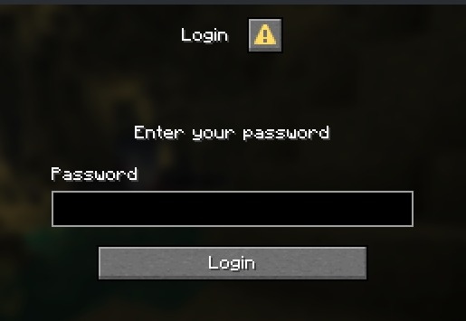

<p align="center">
  
</p>

<p align="center">
  <strong>Authentication for Minecraft networks, from a single proxy to a large fleet.</strong><br>
  Velocity plugin + dedicated Minestom auth servers.
</p>

<p align="center">
  <a href="#status">Status</a> ·
  <a href="#architecture">Architecture</a> ·
  <a href="#features">Features</a> ·
  <a href="#comparison">Comparison</a> ·
  <a href="#compatibility">Compatibility</a> ·
  <a href="#roadmap">Roadmap</a>
</p>

**IDCraft is in beta.** It is not ready for production. Use it on a test network, expect breaking config and API changes, and do not put real player data on it yet.

---

IDCraft is a new authentication stack: a Velocity plugin that decides who must log in, and one or more Minestom auth servers that actually run the login. A small network can run **one proxy and one auth server**. The same design also works for mid-size and very large networks (several proxies, several auth servers, shared SQL, optional Redis).

It sits in the same space as LimboAuth, LibreLogin, nLogin, AuthMe + FastLogin, and similar plugins. Some of those are more mature, support more platforms, or are simpler to install. IDCraft is aimed at people who want dedicated auth servers on Velocity, optional multi-proxy, and a lot of knobs.

There is no proxy-only mode, and there probably never will be. Velocity cannot host the full auth UI (including configuration-phase dialogs). The proxy handles identity and forwarding. Auth servers handle the prompt.

This project was written with the help of AI coding tools. [OXipro](https://github.com/OXipro) designed it, wrote a large part of the important logic, and remains the author. The AI help is mentioned here on purpose.

---

## Screenshots

Add images under `docs/` with the names below.

<p align="center">
  
</p>

[//]: # (Later)
[//]: # (<p align="center"><sub>Configuration-phase dialogs &#40;login / register without joining a world&#41;.<br>)

[//]: # (<code>docs/demo-config-dialog.png</code></sub></p>)

[//]: # ()
[//]: # (<p align="center">)

[//]: # (  )

[//]: # (</p>)

[//]: # ()
[//]: # (<p align="center"><sub>Auth world &#40;void or a custom vanilla world, dialogs after join&#41;.<br>)

[//]: # (<code>docs/demo-auth-world.png</code></sub></p>)

[//]: # ()
[//]: # (<p align="center">)

[//]: # (  )

[//]: # (</p>)

[//]: # ()
[//]: # (<p align="center"><sub>Command auth &#40;<code>/login</code>, <code>/register</code>&#41; for older clients via ViaProxy / ViaVersion.<br>)

[//]: # (<code>docs/demo-command-auth.png</code></sub></p>)

[//]: # ()
[//]: # (<p align="center">)

[//]: # (  )

[//]: # (</p>)

[//]: # ()
[//]: # (<p align="center"><sub>Optional factors &#40;email, TOTP 2FA&#41; on top of password.<br>)

[//]: # (<code>docs/demo-2fa.png</code></sub></p>)

---

## Architecture

A typical setup is one Velocity and one Minestom auth server. You can add more of either later.

```
                    ┌─────────────┐   ┌─────────────┐
   Players -------> │  Velocity   │   │  Velocity   │   one or more proxies
                    │  + IDCraft  │   │  + IDCraft  │
                    └──────┬──────┘   └──────┬──────┘
                           │  Redis pub/sub or plugin messaging
                           v                 v
                    ┌─────────────┐   ┌─────────────┐
                    │  Minestom   │   │  Minestom   │   one or more auth servers
                    │ auth server │   │ auth server │
                    └──────┬──────┘   └──────┬──────┘
                           │                 │
                           v                 v
                    ┌────────────────────────────────┐
                    │  PostgreSQL / MySQL / MariaDB  │
                    │  Redis (optional: sessions, messaging)
                    └────────────────────────────────┘
```

1. Velocity identifies the player (premium, cracked, Floodgate).
2. If a valid session exists, the player skips the auth server and joins the network.
3. Otherwise they are sent to an auth server (picked by the load balancer if you have several).
4. The auth server shows the prompt (config dialog, world dialog, or commands).
5. On success, a session is stored and the proxy forwards the player.

---

## Features

### Scale

Works with a single proxy and a single auth server. If you grow, you can add more auth servers (`NONE`, `ROUND_ROBIN`, `LEAST_PLAYERS`, `OPTIMAL_CHOICE`) and more proxies. Proxies and auth servers can talk over Redis pub/sub (similar idea to RedisBungee messaging) or over plugin messaging (`BUNGEE_PLUGIN`).

### Authentication UI

- Vanilla dialogs during the **configuration phase** (`PLAYER_CONFIG`), before the player joins a world.
- Dialogs after join (`PLAYER_JOIN`) in a dedicated auth instance. AuthMe and others also have in-game dialogs; the extra option here is running them in configuration.
- Custom auth world (vanilla / Anvil world for now, plus a void world).
- Commands (`/login`, `/register`, 2FA) for older clients behind ViaProxy or ViaVersion.
- `AUTO` picks dialogs when the client supports them, otherwise commands.
- Required and optional factors: password, email, TOTP 2FA.
- Password rules: minimum length, no spaces, optional regex.
- Login cooldown after a configurable number of failed attempts.

### Identity and sessions

| Mode | UUID |
| --- | --- |
| `MIXED` | Natural UUID. Premium keeps the Mojang UUID, Floodgate keeps the Floodgate UUID, cracked uses the offline UUID from the username. |
| `CRACKED` | Everyone gets a cracked / offline UUID. |
| `RANDOM` | A new random UUID (until an account exists). |

Sessions are mainly there so people who already proved who they are do not have to type their password or extra factors again on every join. That includes cracked players, and anyone else who is not configured to skip auth.

They also help when things break:

- If an auth server is down, a player with a valid session can still join.
- If Mojang session servers are down, a premium player with a valid session can still join (resume does not depend on Mojang being up).

Sessions have a TTL and can be bound to IP. You can enable them for cracked, premium, or both. The session cache uses Redis. If you disable sessions, you do not need Redis for cache. Redis is still needed if you choose it for realtime messaging.

Premium usernames are cached (positive and negative TTLs) so joins do not hit the Mojang API every time.

Floodgate is supported natively. In `MIXED` mode Bedrock players keep their Floodgate UUID. They can skip the password flow when you configure it that way.

### Languages

Messages are normal YAML language files. [configlang](https://github.com/OXipro) is a small library that loads those files on Velocity and Minestom and picks a language for the player. [cssdb](https://github.com/OXipro) is the settings database configlang uses to store the player's choice.

A player language can come from:

1. What they saved in the database.
2. The client locale.
3. A guess from their IP.
4. The fallback (default `en_US`).

Register can detect a language before the account exists, so the first screen is already in the right language.

### Data and config

- SQL: PostgreSQL, MySQL, MariaDB.
- Redis: optional session cache, and/or pub/sub messaging.
- Plugin messaging if you do not want Redis between proxy and auth server.

Most of the behaviour above is configurable: auth mode, prompt type, dialog phase, factors, password rules, cooldown, session TTL, premium skip, Floodgate skip, premium-name protection, cache TTLs, load balancer, messaging backend, world type, forwarding, languages.

---

## Comparison

This is a rough map of how the projects are shaped, not a ranking. AuthMe, LibreLogin, nLogin, and LimboAuth are more established. Several of them support more platforms than IDCraft does today.

| | IDCraft | LimboAuth | LibreLogin | nLogin | AuthMe + FastLogin |
| --- | :---: | :---: | :---: | :---: | :---: |
| Dedicated auth servers | Yes (Minestom) | Limbo inside the proxy | Optional / backend | Backend | Paper world |
| Several auth servers + load balancing | Yes | No | Limited | Limited | Manual |
| Multi-proxy | Yes | Partial | Partial | Partial | Manual |
| Configuration-phase dialogs | Yes | No | No | No | No |
| In-world / in-game dialogs | Yes | No | No | No | Yes |
| Command auth (old clients) | Yes | Yes | Yes | Yes | Yes |
| Custom auth world | Yes (vanilla world) | Limited | Backend world | Backend world | Yes |
| Floodgate | Yes | Yes | Yes | Yes | Extra plugins |
| Sessions (skip password on reconnect) | Yes | Partial | Partial | Partial | Limited |
| Premium username cache | Yes | Partial | Partial | Yes | FastLogin |
| UUID modes (MIXED / CRACKED / RANDOM) | Yes | Partial | Partial | Partial | No |
| PostgreSQL + MySQL/MariaDB | Yes | Yes | Yes | Yes | Yes |
| Redis (sessions / messaging) | Yes | Partial | Partial | Partial | No |
| Velocity | 3.5+ | Yes | Yes | Yes | Via a bridge |
| Paper / Spigot auth backend | Planned | No | Yes | Yes | Yes |
| Proxy-only mode | No | Yes | Partial | No | No |
| BungeeCord proxy | No | No | Yes | Yes | Yes |

LimboAuth keeps the limbo inside Velocity, which is easier to set up. IDCraft uses real Minestom processes instead, which costs more ops and gives you a real world, configuration dialogs, and extra auth servers if you need them.

---

## Compatibility

| Piece | Today |
| --- | --- |
| Proxy | Velocity 3.5+ only |
| Client versions (through Velocity) | Theoretically 1.7.10 to latest (old protocols use commands) |
| Auth server | Minestom, latest only |
| Bedrock | Floodgate on Velocity |
| Java | 25 |

ViaVersion / ViaBackwards / ViaProxy sit on the proxy. Old clients use commands, not dialogs.

Paper, Spigot, and BungeeCord are not supported as auth backends or proxies yet.

---

## Roadmap

- Paper / Spigot plugin as another auth backend (same API, database, and sessions).
- Richer auth worlds than a single vanilla dimension.
- More factor providers (email / 2FA).

No proxy-only mode is planned. See the note at the top.

---

## Building

See [docs/BUILDING.md](docs/BUILDING.md).

Short version: `./gradlew shadowJar`, then put the Velocity jar on the proxy and run the Minestom jar as the auth server.

---

## Status

Beta. Fine for testing and feedback. Not for production.

---

## Credits

- [Minestom](https://minestom.net/) and [Velocity](https://papermc.io/software/velocity)
- [Shulker](https://github.com/OXipro/Shulker) (optional fleet / agent setup)
- [OXipro](https://github.com/OXipro) (author)
- configlang and cssdb (same author: YAML languages / config, and the settings database)


Parts of the codebase were produced with AI assistance, then reviewed and completed by hand.

---

## License

See [LICENSE.md](LICENSE.md).
